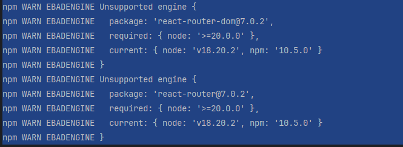

<h1>프로젝트 구성</h1>
<pre>
    <li>라이브러리 버전 맞추기</li>
<pre>
<li>Node.js 18.20.2 버전 기준 react-router-dom 버전의 경우</li>

버전 충돌을 막기 휘애서 downgrade를 해줌

> npm install react-router-dom@6.26.1
</pre>
<pre>
<li>react-router-dom 이용 방법</li>
<pre>
// index.js
root.render(
&lt;BrowserRouter&gt;
    &lt;App /&gt;
&lt;/BrowserRouter&gt;
);
</pre>

<pre>
// app.js
const App = () => {
return (
&lt;div className="App"&gt;
  &lt;Routes&gt;
    &lt;Route path="/" element={&lt;LayOut /&gt;}&gt;
      &lt;Route path="/" element={&lt;MainPage /&gt;} /&gt;
      &lt;Route path="/" element={&lt;DetailPage /&gt;} /&gt;
      &lt;Route path="search" element={&lt;SearchPage /&gt;} /&gt;
    &lt;/Route&gt;
  &lt;/Routes&gt;
&lt;/div&gt;
);
}
</pre>
</pre>
<pre>
<li>버전 차이</li>

> react-router-dom v6 에서는 `element`를 사용함
version 5 이전에는 component 를 사용해서 JSX를 rendering

<li>프로젝트에서 사용하는 v6과 신규버전인 v7의 차이점</li>

>  주요 변경점 및 새로운 기능:
> 1. 프레임워크 모드 도입:
> React Router v7은 Remix의 기능을 통합하여 프레임워크 모드를 제공합니다.
> 이를 통해 서버 사이드 렌더링, 코드 스플리팅, 데이터 로딩 및 변이 등 고급 기능을 활용할 수 있습니다.
> 2. 번들링 및 서버 렌더링 개선:
> Vite 기반의 컴파일러를 도입하여 더 나은 번들링과 서버 렌더링을 지원합니다.
> 이를 통해 React 18에서 19로의 전환이 원활해집니다.
> 3. 향상된 타입 안전성:
> 라우트 매개변수, 로더 데이터, 액션 등에 대한 타입 생성을 통해 타입스크립트 사용 시
> 더욱 안전한 코드를 작성할 수 있습니다.
> 4. 패키지 구조 단순화:
> 이제 react-router-dom 대신 react-router 패키지만으로 필요한 모든 기능을 사용할 수 있습니다.
> 이를 통해 패키지 관리가 더욱 간편해졌습니다.
> 5. 라우팅 설정 파일 지원:
> routes.ts 파일을 통한 라우팅 설정을 지원하여 라우트 구성을 더욱 체계적으로 관리할 수 있습니다.
> 6. 정적 페이지 프리렌더링:
> 정적 페이지의 사전 렌더링을 지원하여 초기 로딩 속도를 개선하고 SEO 최적화에 도움이 됩니다.
> ※ 업그레이드 고려사항:
> a. 비호환성 변경사항:
>    일부 API의 변경으로 인해 기존 코드의 수정이 필요할 수 있습니다.
>    예를 들어, json 및 defer 메서드가 더 이상 사용되지 않으며, 대신 원시 객체를 반환해야 합니다.
> b. 패키지 및 임포트 경로 업데이트:
>    react-router-dom에서 react-router로의 패키지 변경에 따라 임포트 경로를 수정해야 합니다.
>    예를 들어, react-router-dom에서 가져오던 모듈을 이제 react-router에서 가져와야 합니다.
</pre>
</pre>