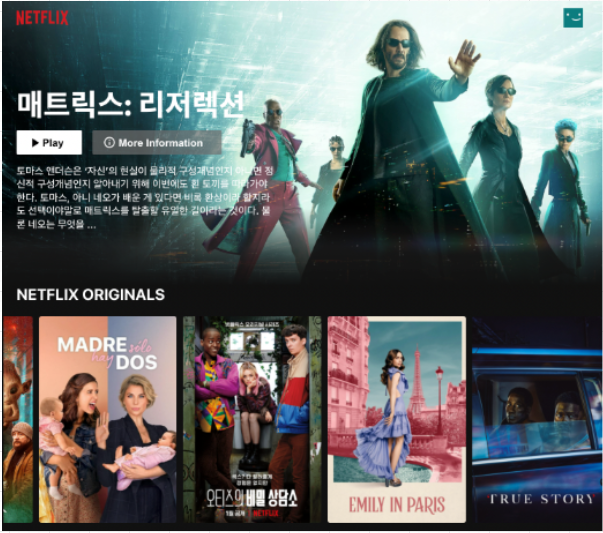

[참고 이미지 링크1](https://lh3.googleusercontent.com/8xDLWXyuY847umy8SdKI9ZeGvLwa1x-pj1mzzdLN-JCCE-gL1343GmRhLad2T2Z4THu_6mhZsFzdDKg2hF0s5I8X9BMoy0N8WDRQT6UwFQSrnZcOJAxp3FHHzR1T9x0orSCKCGHjvY54HLV0pzmFB8s)

[참고 이미지 링크2](https://lh3.googleusercontent.com/Lun462uhac9A7ubcDvwfyuYWQVV0KF6jD6l6QiTy5GWXogAqgaQFMI-1gNAeP5f7ZCy1UTn4i91KrzAlFhu1knxjclPq7BS_yPPU0vUbnjRthZwvSvY6XCpjdSxciECysNO0gEcqdmSObhJ8LSSo0d0)

하위 과제
1. Flex Box 또는 Grid CSS 를 이용해서 영화를 나열합니다.
2. 영화에 마우스로 호버 하면 영화 이미지의 사이지가 크게 될 수 있게 합니다.


환경 설정
- node.js v18.20.5 (LTS)  
[다운로드 링크](https://nodejs.org/en/download/package-manager)
- react-router-dom
```angular2html
npm install react-router-dom@6.26.1
```

<h1>화면 구성</h1>
